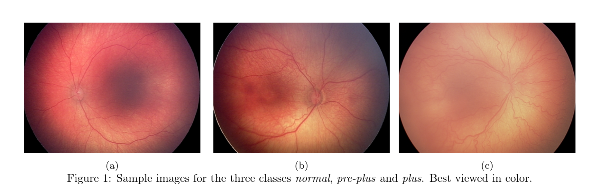
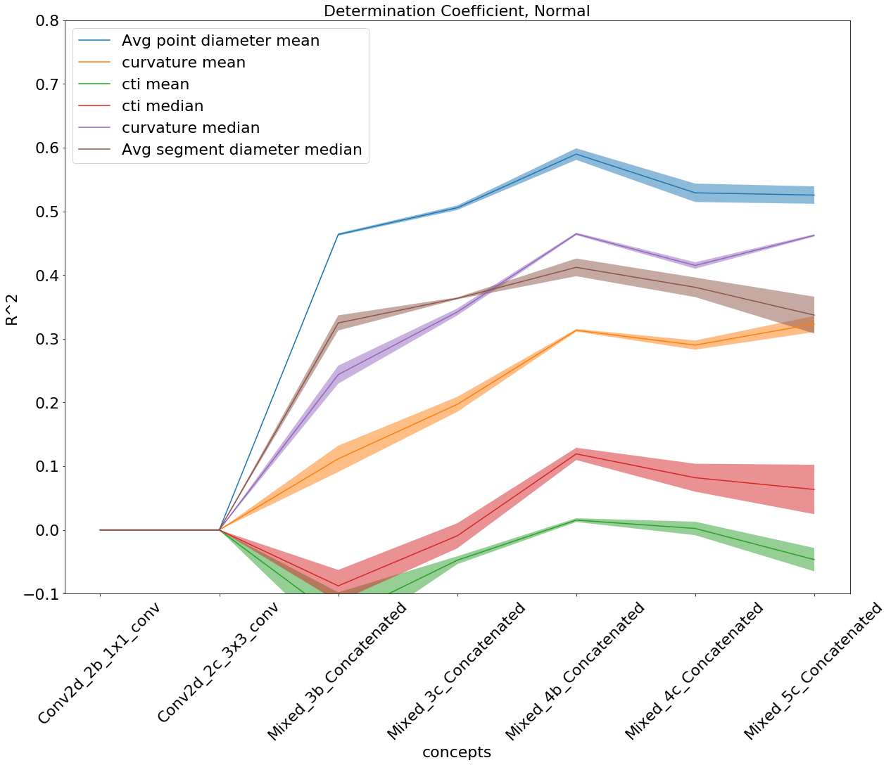
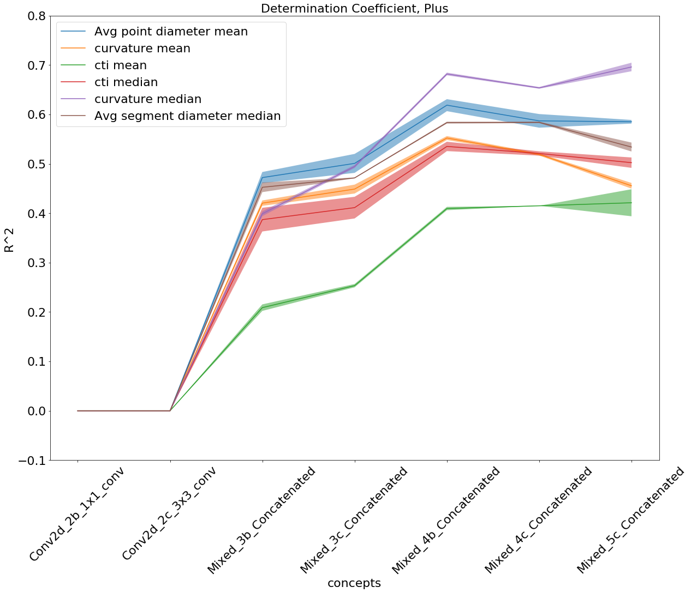
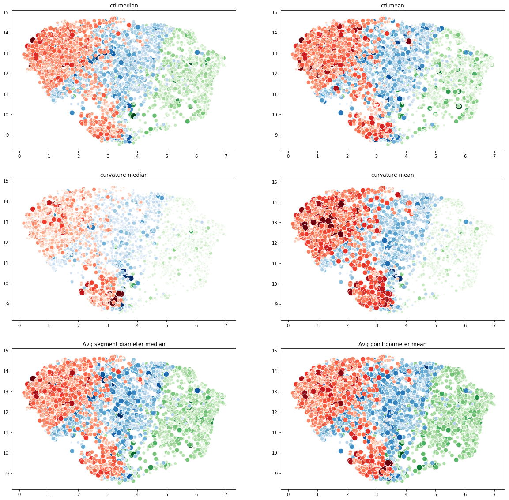
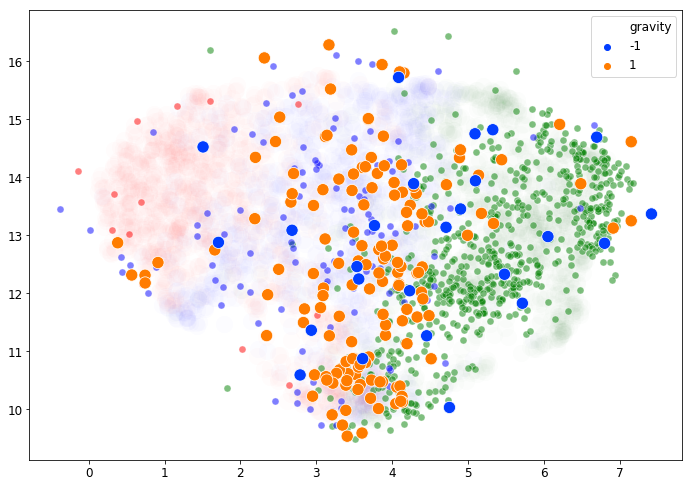

# SPIE2019_interpretableROP
This repository contains the code to interpret the classification of the Plus disease in Rethinopathy of Prematurity images by a deep CNN. This paper was presented at SPIE2019 Medical Imaging at the Computer Aided Diagnosis track. 

## Reference
main paper to be cited: 
'''
@article{graziani2019improved,
  title={Improved Interpretability for Computer-Aided Severity Assessment of Retinopathy of Prematurity },
  author={Graziani, Mara and Brown, James and Andrearczyck, Vincent and Yildiz, Veysi and Campbell, J Peter and Erdogmus, Deniz and Ioannidis, Stratis and Chiang, Micheal F and Kalpathy-Kramer, Jayashree and Muller, Henning},
  journal={Medical Imaging 2019: Computer-Aided Diagnosis},
  year={2019}
}
'''

Computer-aided diagnosis tools for Retinopathy of Prematurity (ROP) base their decisions on handcrafted retinal features that highly correlate with expert diagnoses, such as arterial and venous curvature, tortuosity and dilation. Deep learning leads to performance comparable to those of expert physicians, albeit not ensuring that the same clinical factors are learned in the deep representations. In this paper, we investigate the relationship between the handcrafted and the deep learning features in the context of ROP diagnosis.
Results show that the curvature, diameter and tortuosity of the segmented vessels are indeed relevant to the classification. Among the potential applications of this method, the analysis of borderline cases between the classes and of network faults, in particular, can be used to improve the performance.

This work is the output of a tight collaboration with the Quantitative Tumor Imaging Lab at the Martinos Center for Biomedical Imaging in Charlestown (MA). The code base for preprocessing, segmentation and classification retinal of the retinal images, and the diagnosis of the "plus disease" was obtained with the network developed by the Quantitative Tumor Imaging Lab at Martinos: https://github.com/QTIM-Lab/qtim_ROP. The handcrafted features were kindly provided by the Electrical and Computer Engineering Department at Northeastern University and the work was strictly supervised by the Department of Ophtalmology, Casey Eye Istitute at Oregon Health and Science University in Portland (OR). 

## Dataset 
A  database  of  4800  de-identified  posterior  retinal  images  is  used  to  perform  the  analysis.   The  images  were
captured by a commercially available camera (RetCam; Natus Medical Incorporated, Pleasanton, CA). Below we show a sample input for each class. 

    

## Preview of the results
We show in the following the coefficient of determination of the regression concept vectors computed at different layers of the network, averaged over 3 repetitions, for (a) normal and (b) Plus input samples.  95% confidence intervals computed over 3 repetitions are also illustrated. 

    

    

UMAP representation at the Mixed 5c Concatenated layer of the Inception model.  The three colors respresent the three classes, respectively normal as green, pre-plus as blue and plus as red.  The color intensity and the size of the data point have been changed to show the value of the concept measure.  Smaller values of the concept measure correspond to less bright, smaller data points. 

    

## Analysis of misclassification

Figure 5 illustrates the misclassification errors in the
2D UMAP compression of the activations of the Mixed5cConcatenated layer.  Most of the misclassification errors are made at the decision boundary between pre-plus and normal, at gravity 1 (points in orange color).

    

